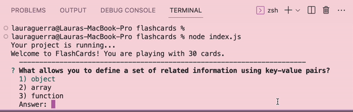

# FlashCards 

## Abstract: 

This console playable game provides a set of flashcards and functionality to choose answers for the questions. The inital production data set contains questions about javascript. However, the functions in this codebase were set up dynamically in order to allow for other study topics. To further represent this functionality an extension was added to the projects MVP - the `fetch` method was used to call a REST API with trivia questions about celebrities. The game can also be played with that varying data. Testing was implemented with the Mocha framework and Chai library. 

<div align="center">
<b>Built With:</b>
<br>
Javascript
<br>
<em>Additional Technologies:</em>
<br>
 Mocha & Chai  | REST API

</div>

## Installation Instructions 

- Fork this repository.
- Copy the SSH key and clone it to your local directory. 
- `cd` into the repository 
- run `node index.js` to play the game in the console. 


## Preview of App:


## Context: 
- Mod 2, Week 1: 
  - I am a current student of Turing School of Software & Design. 
  - Turing is a 7 month program, which offers a total of 4 modules. 
  - This project was made during the first week of the second module that the program has to offer. 

- A total of 6-8 hours was spent on this project. 

## Contributors: 
[Laura Garcia Guerra](https://github.com/lauraguerra1)

## Learning Goals:
- Contribute code to an partially constructed application
- Follow spec/prompts to make a working application
- Write modular, reusable code that follows SRP 
- Implement a robust testing suite using TDD

## Wins & Challenges: 
   - My overall biggest win was the addition of the extension in which I fetched an API to create flashcards with trivia questions about celebrities. 

  - My largest challenge was making sure that the current flashcard being displayed was tied to which turn the user was on. Instead of updating the card for each turn, I wanted the current flash card to be set up dynamically so that on the first turn, the first card in the deck would be displayed, and so on and so forth for the remaining turns and cards. I was able to overcome this challenge through completing some reseach. I familiarized myself with `getter methods` which provided me with access to the values of my `round` object before it had been initialized. Thus the following code in my `createRound` function allowed the current flash card to always be dependent on the round's current turn: 
  ``` 
   const round = {
    deck: deck.cards,
    get currentCard() {
      return this.deck[this.turns];
    },
    turns: 0,
    incorrectGuesses:[]
  }
  ``` 

